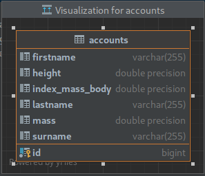

<h1> Секция "Разработка ПО" в олимпиаде "Цифровая весна" </h1>

<h2> Было рализован метод добавление аккаунта, который имеет такие поля как </h2>

- Имя
- Фамилия
- Отчетство
- Вес
- Рост
- Индекс массы тела
- Возраст

<h2> ER-диаграмма базы данных, которая используется для приложения </h2>

<h2> Стек приложения </h2>

- Java 17
- Spring Boot 2.7.11
- Postgres
- Spring Data JPA
- lombok